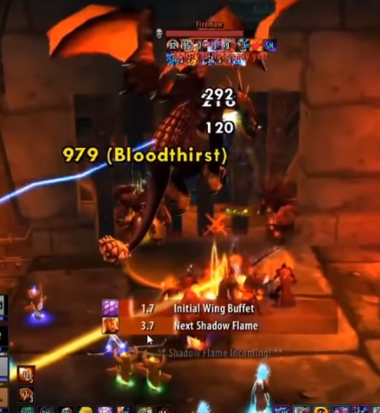
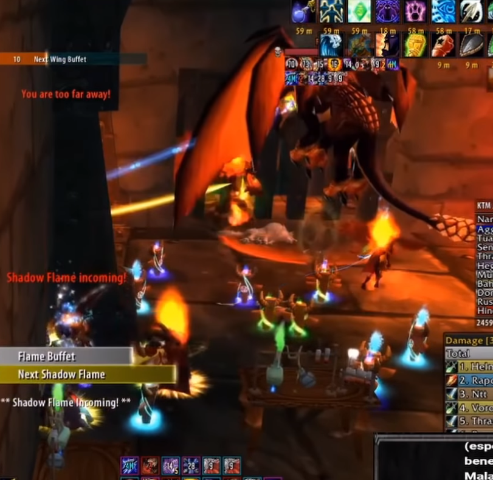

# Alchemy Lab

## Trash

After broodlord is killed, clear the second floor of the supression room. 
The trash in the alchemy lab (known as the "lab packs") consist of a mix of
Warlocks, Spellbinders, Goblins, and Death Talon Overseers. A tank needs to be
assigned to each of these and they have a kill order of Warlocks > Spellbinders/Overseer > Goblins.

The warlocks do a large amount of AoE damage and should be burned down as quickly as possible.
Their shadow bolt volleys should be kicked and the group should be careful to stay away from the
tanks to avoid flamestrikes. The demons despawn after 5 minutes. 

Once they are down, the raid should split up and melee should attack the Spellbinders
(who are invulneral to magic) while ranged dps attacks the Overseers. The Overseers have
very high resistance for 4 of the 5 damage types, and are very weak to one. Once the
group pulls one of these mobs, everyone should try a different damage type and call out
the type when they see big numbers. If a ranged dps cannot do damage of the appropriate
type, they should focus on another mob if possible.

When attacking spellbinders, the dps should attack on the opposite side of the spellbinder
as the tank in order to avoid AoE damage.

## The Dragons

The next three pulls are all drake bosses. They each share 3 the same three spells and have one
extra one.

_Abilities_

**Shadow Flame**: Deals 4000-5000 damage in a frontal cone. Handling this is very similar to a
Onyxia's flame breath. Healers should make sure that the tank is topped off/shielded before this is
cast.

**Wing Buffet**: Wing buffet knocks the target back and drops their threat by 50%. The off-tank should
taunt the drake 3-4 seconds before this is cast so that the main tank can maintain threat.

**Thrash**: Gives the attacker two extra attacks. Their melee do around 1k dmg so this will do 3000-4000
damage randomly. This is why the tank must always be topped off and the dps can be largely ignored.

### Firemaw

_Abilities_

**See Above**

**Flame Buffet**: Inflicts 139 to 161 Fire damage to an enemy and increases the Fire damage it takes by 150 for 20 sec.

_Strategy_

Positioning is everything in this fight. If the boss moves even a little, the raid will wipe. Luckily,
melee don't have to take damage if they don't want to. There is a spot in the map where they can stand
and avoid any damage, allowing them to bandage. Healers should focus primarily on keeping the tank up.

The two tanks will stand in the gateway on the left. Each of them on opposite ends of the gate. Like they
will do with the other drakes. 4-5 seconds before Wing buffet, the off tank should taunt Firemaw off of the
tank so their aggro is wiped instead of the main tank.

The main source of concern for non-tanks is Flame Buffet which will slowly tick away as the fight progresses.
Eventually stacks will build up to an unsustainable point. When that happens (around 5 stacks) raiders should
break LoS behind the column to drop their stacks. The tanks should swap around 7 stacks if it doesn't drop
off before then.

**Notes**

- Tank should wear FR gear

### Ebonroc

_Abilities_

**See Above**

**Shadow of Ebonroc**: A debuff that falls on the person with highest threat and heals ebonroc for 25k when that person is hit by the boss.

_Strategy_

Without Flame Buffet forcing you into a tight position, this fight is largely an easier version of Firemaw. Three tanks are recommended and they should cycle taunts after one of them gets Shadows of
Ebonroc.

**Notes**

- A little amount of shadow resist on your tanks (around 100) will reduce your chance of getting hit by Shadow of Ebonroc to 25%.

### Flamegor

_Abilities_

**See Above**

**Firenova**: Inflicts fire damage to nearby enemies

_Strategy_

This is a tranq shot boss like Magmadar in Molten Core. Every 10-15 seconds, Flamegor will enrage and start
casting `Fire Nova`. This is easily mitigated with at least two hunters cycling tranq shots to prevent raid damage.
Other than that, the fight is exactly like Ebonroc.
