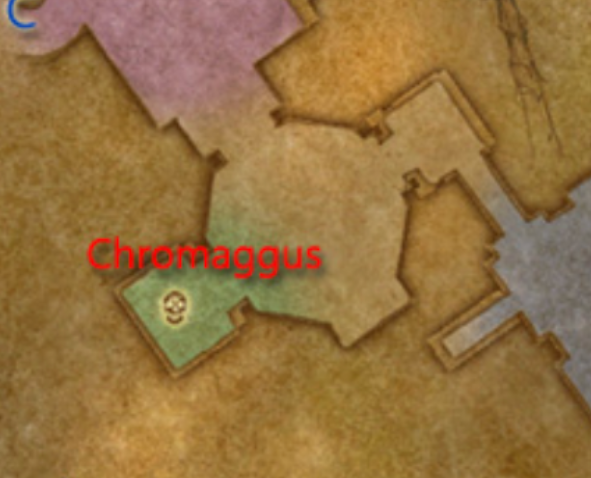
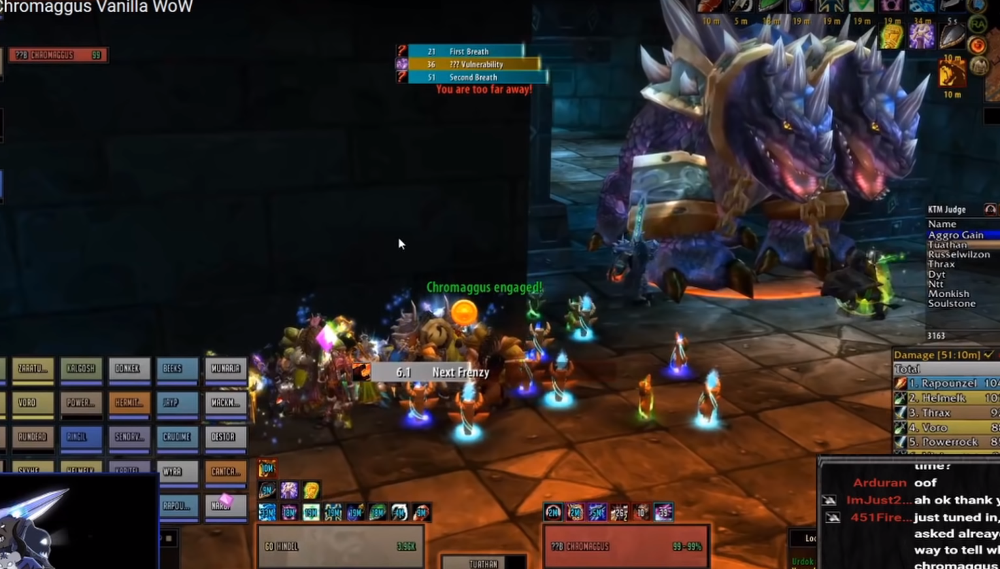

# Chrommagus

## General Idea

There are three and a half mechanics in the fight that require attention.
The first is a "frontal" breath that damages everyone in line of sight instead of
an actual cone. To avoid this, the raid will be moving back and forth from behind
a wall. As this is happening, raid members will get a few different debuffs each
with their own effect. If a player gets all 5 debuffs, they turn into a dragon and
have to be killed. While all of that is going on, Chromaggus will occationally gain
vunerability to a single school of magic. When this happens, casters of the appropriate
school will do signifcantly more damage (and threat). At 20%, Chromaggus, enrages and hits significantly harder.

## Positioning

In order to avoid the breaths, the entire raid (except the main tank) needs to be out of line of sight
when a breath is being cast. Ranged and heals should stay behind one of the walls in the entrance
his room and can remain stationary for the rest of the fight. Melee need to run to the same spot as
the healers to avoid being hit by the breath. If that is too far for someone, they can hide behind
the column by his foot. This does prevent them from getting heals/decurses so it should be
avoided when possible.

## Breaths

During the fight, Chromaggus will cast two different kinds of breaths. Which two
breaths he casts is chosen from a pool of five different options the first time the raid enters
BWL. This selection will remain until the lockout reset. On the first pull of the week, the raid
needs to assume that Time Lapse is one of them and hold back on threat until they are revealed.

- **Incinerate** : Deals 3675-4275 Fire damage. (This spell will hit for nearly 9000 Fire damage if you have the Black Affliction)
- **Corrosive Acid**: Deals 875 to 1125 Nature damage every 3 sec for 15 seconds. Armour reduced by 3938 to 5062.
- **Frost Burn**: Attack speed reduced by 80%. Does approximately 1400 Frost damage.
- **Ignite Flesh** : 657-843 Fire damage every three seconds for 60 seconds. This can stack if he casts it again within the 60 seconds.
- **Time Lapse** : Stun for 6 seconds, reduces maximum health points to half and reduces the
  target's threat. As with all stuns, Chromaggus will attack non-stunned characters first. When
  this debuff wears off, health points are raised again, effectively healing you. Ideally, the dps
  should get hit by timelapse to keep their threat low.

**Notes**

- Tank should use stoneshield potions for Corrosive Acid.
- DPS should get hit by Time Lapse, off-tank shouldn't and hold chromaggus where the tank holds him.

## Brood Afflicition

Periodically during the fight, raiders will get one of five different buffs, four of which can be
dispelled. While having one or two debuffs isn't terrible, a raider with 3 debuffs needs to be cured
immediately.

- **Black**: Increase fire damage taken by 100%
- **Green**: Deals 250 damage every 5 sec. Healing effects reduced by 50%.
- **Blue**: Drains 50 mana every 1 sec. Casting speed reduced by 50%. Movement speed reducedd by 30%.
- **Red**: Deals 50 damage every 3 seconds. On death, heals Chromaggus.
- **Bronze**: Randomly stuns for 4 seconds. This debuff cannot be dispelled and must be removed with an item that is dropped by trash called Hourglass Sand.

**Notes**:

- Restorative potions are very useful on this fight
- Red is not super high priority but should be dispelled to prevent someone from quickly spiraling
  out of control
- Sand should be distributed like so: 4 to MT, 3 to healers (2 to pallies), 3 to hunters, 1 to other DPS.
  If there's only one sand left, it should be saved for after 20% (when he enrages).
