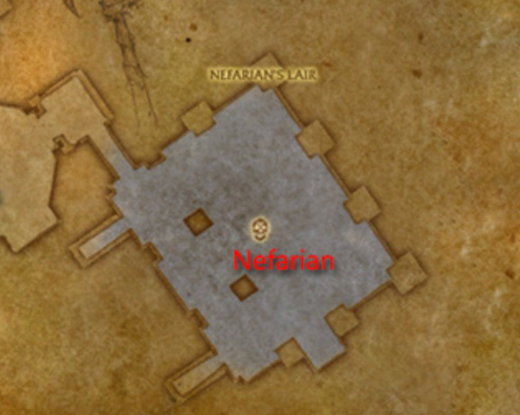

# Nefarian

## Phase 1 -Trash

Before fighting Nefarian, the raid will have to deal with two diferent spawns of adds.
Each spawn will generate drakonids of a different color. Each drakonid is immune to
damage depending on the color. These mobs need to be killed as deep in the rooms as
possible.

## Phase 2 - Class Calls

Once the mobs are down spawning (40 from each? a minute?) nefarian wil land and the second phase
starts. The main tank should hold him on the edge with the mages on the far corner and
the rest of the raid standing near Nefarian's throne.

-- **Warrior**: Forced into breserker stance and take 30% more damage. Heal the shit out of the tank
-- **Paladin**: They cast BoP on Nefarian
-- **Warlock**: Each warlock summons two infernals that have to be killed
-- **Druid**: Turns you into cat form
-- **Shaman**: Drops corrupted totems
-- **Hunter**: Breaks the hunter ranged weapon
-- **Priest**: Make the priest heals corrupted and cause dots instead of heals. Power word shield still works.
-- **Mage**: Randomly polymorph people. The mages should be positioned at the far end of the room so they only polymorph themselves
-- **Rogue**: Rogues get rooted around nefarian. They can vanish/imp sprint/evasion

## Phase 3 - Raise the Dead

Once Nefarian gets to 20%, all of the mobs that were killed in the first phase raise and attack
the group. Its imperative that the group waits for one of the free class calls before pushing them over
(Paladin, Rogue, Hunter). The mage group should focus on one of the groups while the rest of the
group gets the rest of the raid.
