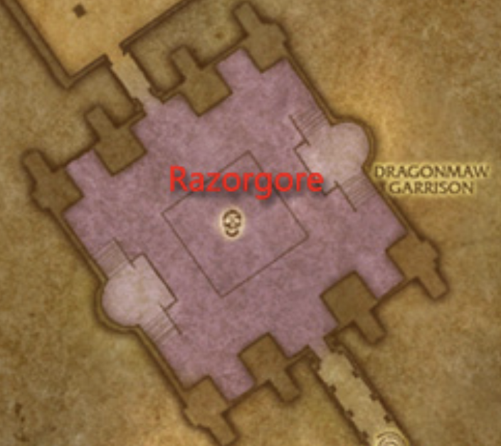

# Razorgore the Untamed

## General Idea

The room starts filled with 30 eggs and a few mobs on a platform along the south-western wall.
One of these mobs is channeling a spell that is keeping Razorgore passive.

This fight is broken up into two phases. In the first phase, one player (peferably the MT)
uses Razorgore to break the eggs in the room. During that time, adds will continuously
spawn and have to be killed by the rest of the raid. The moment the last egg is destroyed,
all of the mobs run out of the room and the second phase begins. In the second phase, the
group burns Razorgore down while dipping behind a wall to avoid raid-wide damage.

NOTE: When you're done with the fight, don't leave the room. If you cross the door before
pulling the goblins inside, we will lose a chance at elementium ore (necessary for thunderfury).

## Raid Group Makeup

We are going to be splitting the raid up into two halves for phase 1. Make sure each half
has an even mix of classes.

## Phase 1

Two things will be happening simultaneously during this phase. One character (the main tank
preferrably) will be controlling Razorgore and using [Break Egg]() to smash the eggs on the
ground. While that is happening, the rest of the raid will have to kill many waves of mobs that
spawn in each corner roughly every 15 seconds.

The entire raid should begin in the southern corner. After a tank (who is not the MT taking the orb)
charges in, the mob keeping Razorgore subdued will release him. The orb controller must use the orb before
Razorgore start beating on raiders. To make this easier, the controller can position themselves on the ground,
underneath the orb.

After burning down the mobs that were standing on the platform, one half of the raid should continue over
the platform and stay roughly grouped on the western corner, the other should stay in the southern corner.
Healers and ranged DPS should move to the platform in order to avoid any cleave.

Three different kinds of mobs will spawn: Legionaires, Mages and Dragons. As the mobs spawn they will come to
the raid to be killed. The kill priority is Mages, then Dragons, then Legionaires. Classes with a 
counterspell/silence should interrupt the mages in the far corners so they join the rest of the group.
Yes, warriors you can Intercept and Shield Bash, just come back quick. If a tank has two dragons on 
them, they might need to pop cooldowns so they should be ready to ask for help.

Once the last egg is down, all of the mobs will run out of the room and phase two will begin.

## Phase 2

Once the last egg goes down, tank will have all the aggro and will hold him
by the west corner of the inner square. The ranged dps should stack on a marked player who
will move behind the wall on the south side of the platform to avoid fireball volley. A melee
DPS will also be calling for a retreat to the same wall (very similar to Rag).

Note, in this photo. A large majority of the ranged DPS are making a mistake. They should be more tightly
grouped on the yellow star. In this video, many of the people far out on the right get hit by the fireballs.
Don't be them.

During this time, Razorgore will conflagerate just like Drakkisath in UBRS. Unforunately Razorgore
is immune to taunt so whoever is next on threat will get hit. This means that DPS has to be very
careful about their threat and make sure that the Off-Tank is second. If they are unable to generate
enough threat when off-tanking as deep prot then they should consider fury-prot for more threat.
