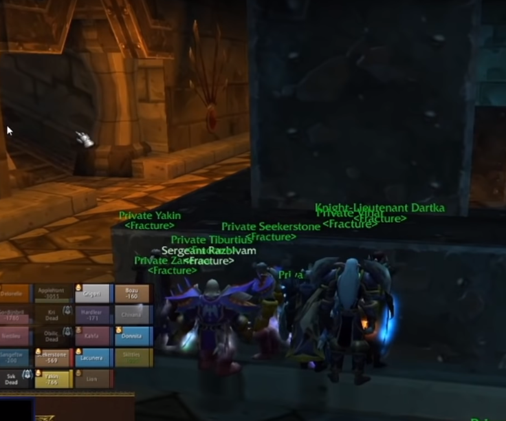

# Vael Trash / Supression Room / Broodlord

## Vael Trash

The trash is skippable by having the entire raid hide like while a hunter pulls the group
and feigns.

If your raid is up for it, the Death Talon Captain should be kited by a hunter around Vael's
room by running up and down the stairs. Remember, it is important that someone in the raid buffs
the hunter. If not there is a possibility that when the hunter resets, the mobs will respawn.

The mobs should be tanked (1 tank to each) on the corner before the path on to the supression room.
Wyrmkinds need to be kept asleep by druids.
