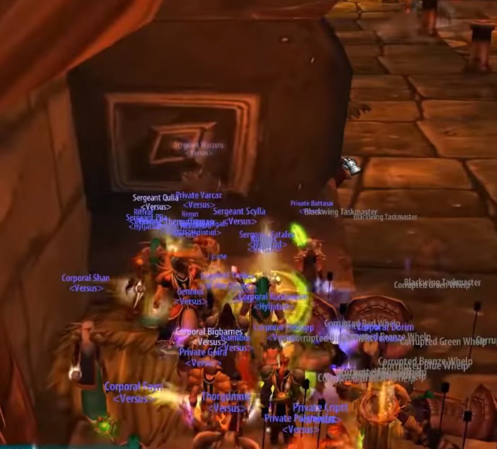

# Trash after Vael / Supression Room / Broodlord

Once vael is dead, the next target is the infamous Supression Room and then onto Broodlord Lashlayer.
Before the raid can enter the gauntlet, there is some trash they must go through.

## Vael Trash

The trash is skippable by having the entire raid hide behind a corner while a hunter pulls the group
and feigns once everyone's through.

If your raid is up for it, the mobs can be killed and have a chance to drop epics. The Death Talon Captain
should be kited by a hunter around Vael's room by running up and down the stairs while the rest of the raid get
the mobs. Make sure that someone in the raid buffs the hunter while they're running around. If not, there is
a possibility that the mobs will respawn when the hunter resets. [This video](https://youtu.be/ViurYyGYBCs?t=140)
provides a good overview of how to kite this pack.

The mobs should be tanked on the corner before the path on to the supression room (1 tank to each).
Wyrmkinds need to be kept asleep by druids.

## Supression Room

Welcome to the infamous suppression room. There are two floors to this part of BWL that are the exact same.
Each floor is filled with a 3 by 5 grid of totems that emits a AoE [debuff](https://classic.wowhead.com/spell=22247/suppression-aura)
that slows the the raid to a crawl. In order to make those goes away, rogues have to be constantly using
disarm trap. That is their only focus for this whole room and the boss to follow.

Walking through the area of a bunch of mobs that patrol around the room and a horde of whleps. These whelps come in three different
varieties, each immune to a different school of magic (red immune to fire, blue immune to frost, and green immune to nature, bronze to arcane).
Whelps respawn after 15 seconds which means if their deaths are staggered, the raid will never get a chance to go out of combat and
drink. That means that these whelps MUST be ignored by DPS until the raid leader calls for their death at the far corner. A single warrior
with AoE equipment (Force Reactive Disk, Essence of Pure Flame, etc.) should be responsible for holding onto the whelps while the
rest of the raid handles the other mobs.

The raid will start by pulling the closest pack of whelps on the left side and proceed down hugging the wall very tightly. A hunter
should pull one dragon at a time, or one pack of three orcs. When a mob is pulled, the raid should stack behind the nearest pillar
and using only single target abilities, burn the mob down.

Dragons' flamestrike should be kicked although the tank can position themselves so that the raid does not get hit
if they are stacking behind the column by going close to the column behind the raid. The packs of orcs do an AoE heal
and should be sheeped and then taken down one by one. If some whelps have been hurt, you can use the orcs' heal to
bring them back up to full.

Notes:

- If there are two dragons being pulled, someone else can pull one off of the hunter who then feings, resetting only one of them.
- DO NOT dps the whelps until the raid leader calls for it.
- All stacks have to be super tight in this room. The entire group of 40 should look like one person.
- If your raid get frusterated, apparently hunters [can kite](https://www.youtube.com/watch?v=7bNyXFhTUjU) the mobs

## Broodlord Lashlayer

Having gotten through the Supression Room, this fight is most a tank and spank. Rogues are still
responsible for disarming the supression devices and dps should get whelps down when the boss is
pulled. However if everyone does their job, the boss should go down without too much trouble.

He has a frontal cone that knocks the tanks back, a 50% aggro dump on the person with the highest threat,
and a mortal strike that's famous for critting for 8000 on plate wearers. The tanks (3-4) will hold him
tucked away in a corner so the knockback doesn't send them away and fight for threat. The rest of the DPS
must stay behind the tank's threat so they don't turn the boss around, blast the whole raid
with [Blast Wave](https://classic.wowhead.com/spell=23331/blast-wave), and kill everyone.

Notes:

- He mortal strikes about every 20 seconds. The tank must have a shield on to withstand this blow. After the tank recevies a
  Mortal strike, they are free to go back to DW to generate as much threat as they can.
